# Architecture API Intelligence

## Modules bornes

- `src/modules/platform-admin/`: autorisation globale et attribution locale controlee.
- `src/modules/software-directory/`: logiciels, domaines, produits API, sources et snapshots.
- `src/modules/api-intelligence/discovery/`: validation URL/DNS, robots, fetch HTTPS borne, redaction et relectures planifiees.
- `src/modules/api-intelligence/analyzer/`: analyse deterministe OpenAPI JSON/YAML, Postman Collection v2.1 JSON, GraphQL SDL/introspection JSON fournis et metadonnees OAuth JSON officielles, puis previsualisation.
- `src/modules/api-intelligence/change-monitor/`: comparaison deterministe, classification, impacts tenant, contrats de changement et plans de reparation.
- `src/modules/api-intelligence/ontology/`: mappings tenant avec preuve et approbation.
- `src/modules/api-intelligence/compatibility.ts`: resultat tenant explique par operations, mappings et preuves.
- `src/modules/connector-copilot/`: manifestes desactives, tests mock, demandes d'approbation et Connect Store prive.

`src/lib/services.ts` reste une facade de composition sans SQL metier.

## Flux de confiance

```mermaid
flowchart LR
  A["Domaine en attente"] --> B["Approbation plateforme"]
  B --> C["Fetch HTTPS borne"]
  B --> S["Scan sitemap borne"]
  S --> T["Candidats sous revue"]
  T --> C
  C --> D["Snapshot et hash"]
  D --> E["Previsualisation deterministe"]
  E --> F["Operations, schemas et preuves"]
  F --> G["Claims approuves"]
  G --> H["Mapping tenant approuve"]
  H --> I["Compatibilite expliquee"]
  I --> J["Proposition desactivee"]
  J --> K["Tests de contrat mock"]
  K --> L["Approbation sandbox"]
  L --> M["Connect Store prive"]
  D --> N["Snapshot suivant"]
  B --> R["Planification approuvee"]
  R --> C
  N --> O["Comparaison deterministe"]
  O --> P["Impact tenant et blocage"]
  P --> Q["Plan de reparation soumis a approbation"]
  Q --> U["Nouvelle version desactivee"]
  U --> V["Tests mock et approbation sandbox"]
```

Chaque transition sensible est autorisee cote serveur et auditee. La previsualisation n'est pas une autorite: le service recharge le snapshot, selectionne le parseur selon le type de source, recalcule le document et exige une correspondance exacte avant d'ecrire.

## Isolation

Les connaissances issues des sources officielles et les evenements de changement sont globaux. Les mappings, analyses de compatibilite, propositions, tests, approbations, impacts de changement et entrees du Connect Store portent `tenant_id`.

Ces tables utilisent:

- un filtre tenant explicite dans les repositories;
- une verification de membership cote service;
- des politiques PostgreSQL RLS;
- des index commencant par `tenant_id`;
- des triggers d'integrite entre proposition, test, approbation et Connect Store.

Un mapping tenant ne peut jamais etre promu automatiquement en connaissance globale. Le fan-out d'un changement global vers plusieurs tenants utilise une transaction systeme explicite apres autorisation plateforme; chaque impact reste ensuite invisible aux autres tenants sous un role PostgreSQL restreint.

La promotion d'un mapping exige un administrateur plateforme, un mapping tenant approuve et une preuve officielle encore approuvee. Le modele global ne contient aucune reference au tenant source. Sa reutilisation produit un nouveau mapping tenant `pending`; l'approbation d'origine ne traverse jamais la frontiere tenant.

Les reparations sont des propositions versionnees reliees a un impact, au connecteur source et au snapshot courant. Les triggers PostgreSQL imposent le meme tenant et le meme produit API pour toutes ces relations. Les imports conservent les anciennes preuves encore referencees par un mapping, mais les operations, schemas, claims et preuves du nouveau snapshot utilisent des identifiants distincts.

## Frontieres actuelles

L'architecture utilise PostgreSQL relationnel. Elle n'ajoute ni base graphe, ni crawler general, ni execution de code dynamique. Le scan de sitemap est une file de candidats bornee sur le domaine exact approuve: une decision humaine cree la source, puis le fetch et l'import restent des actions separees. Les relectures existantes restent strictement limitees aux URL officielles deja approuvees.
