# Architecture API Intelligence

## Modules bornes

- `src/modules/platform-admin/`: autorisation globale et attribution locale controlee.
- `src/modules/software-directory/`: logiciels, domaines, produits API, sources et snapshots.
- `src/modules/api-intelligence/discovery/`: validation URL/DNS, robots, fetch HTTPS borne et redaction.
- `src/modules/api-intelligence/analyzer/`: analyse deterministe OpenAPI JSON/YAML et previsualisation.
- `src/modules/api-intelligence/ontology/`: mappings tenant avec preuve et approbation.
- `src/modules/api-intelligence/compatibility.ts`: resultat tenant explique par operations, mappings et preuves.
- `src/modules/connector-copilot/`: manifestes desactives, tests mock, demandes d'approbation et Connect Store prive.

`src/lib/services.ts` reste une facade de composition sans SQL metier.

## Flux de confiance

```mermaid
flowchart LR
  A["Domaine en attente"] --> B["Approbation plateforme"]
  B --> C["Fetch HTTPS borne"]
  C --> D["Snapshot et hash"]
  D --> E["Previsualisation OpenAPI"]
  E --> F["Operations, schemas et preuves"]
  F --> G["Claims approuves"]
  G --> H["Mapping tenant approuve"]
  H --> I["Compatibilite expliquee"]
  I --> J["Proposition desactivee"]
  J --> K["Tests de contrat mock"]
  K --> L["Approbation sandbox"]
  L --> M["Connect Store prive"]
```

Chaque transition sensible est autorisee cote serveur et auditee. La previsualisation OpenAPI n'est pas une autorite: le service recharge le snapshot, recalcule le document et exige une correspondance exacte avant d'ecrire.

## Isolation

Les connaissances issues des sources officielles sont globales. Les mappings, analyses de compatibilite, propositions, tests, approbations et entrees du Connect Store portent `tenant_id`.

Ces tables utilisent:

- un filtre tenant explicite dans les repositories;
- une verification de membership cote service;
- des politiques PostgreSQL RLS;
- des index commencant par `tenant_id`;
- des triggers d'integrite entre proposition, test, approbation et Connect Store.

Un mapping tenant ne peut jamais etre promu automatiquement en connaissance globale.

## Frontieres actuelles

L'architecture utilise PostgreSQL relationnel. Elle n'ajoute ni base graphe, ni crawler general, ni execution de code dynamique. Les futurs importeurs et le moniteur de changements doivent reutiliser les memes sources, snapshots, preuves et decisions d'approbation.
